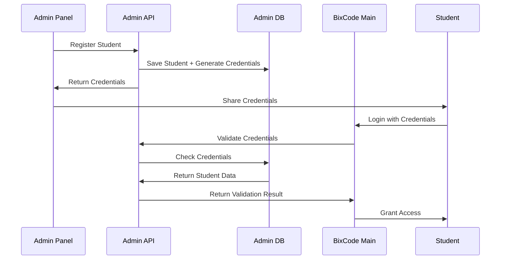

# BixCode Admin Panel Integration Guide

This document explains how to integrate the separate Admin Panel with the main BixCode project for student authentication.

## Architecture Overview

```
┌─────────────────────┐    API Calls    ┌─────────────────────┐
│   BixCode Main      │ ──────────────► │   Admin Panel       │
│   (bixcode_gui_2025)│                 │   (admin-panel)     │
│                     │                 │                     │
│ - Student Login     │                 │ - Student Management│
│ - Learning Platform │                 │ - Credential Gen    │
│ - Progress Tracking │                 │ - Admin Dashboard   │
└─────────────────────┘                 └─────────────────────┘
```

## Integration Steps

### 1. Admin Panel Setup

First, ensure the Admin Panel is running:

```bash
cd admin-panel
npm run dev
```

- Admin Panel Frontend: http://localhost:3001
- Admin Panel API: http://localhost:5001

### 2. Student Registration Flow

1. **Admin registers students** in Admin Panel
2. **System auto-generates credentials**:
   - Username: `john1234` (name + 4-digit random)
   - Password: `A7k9mN2p` (8-character alphanumeric)
3. **Admin shares credentials** with students
4. **Students use credentials** to login to BixCode

### 3. BixCode Authentication Integration

#### Option A: Direct API Integration (Recommended)

Add this to your BixCode sign-in component:

```javascript
// In bixcode_gui_2025/src/components/signin/signin.jsx

const validateStudentCredentials = async (username, password) => {
  try {
    const response = await fetch('http://localhost:5001/api/students/validate-credentials', {
      method: 'POST',
      headers: {
        'Content-Type': 'application/json',
      },
      body: JSON.stringify({ username, password })
    });

    const data = await response.json();
    
    if (data.success) {
      // Student credentials are valid
      return {
        valid: true,
        student: data.student
      };
    } else {
      return { valid: false };
    }
  } catch (error) {
    console.error('Credential validation failed:', error);
    return { valid: false };
  }
};

// Use in your login handler
const handleStudentLogin = async (username, password) => {
  const result = await validateStudentCredentials(username, password);
  
  if (result.valid) {
    // Student is authenticated
    // Set student session and redirect to learning platform
    console.log('Student logged in:', result.student);
  } else {
    // Show error message
    setError('Invalid credentials');
  }
};
```

#### Option B: Proxy Through Main Backend

Create an endpoint in your main BixCode backend:

```javascript
// In bixcode_gui_2025/backend/src/routes/auth.js

router.post('/validate-student', async (req, res) => {
  try {
    const { username, password } = req.body;
    
    const response = await fetch('http://localhost:5001/api/students/validate-credentials', {
      method: 'POST',
      headers: { 'Content-Type': 'application/json' },
      body: JSON.stringify({ username, password })
    });
    
    const data = await response.json();
    res.json(data);
  } catch (error) {
    res.status(500).json({ success: false, message: 'Validation failed' });
  }
});
```

### 4. Environment Configuration

#### Admin Panel Environment

```bash
# admin-panel/backend/.env
PORT=5001
MONGODB_URI=mongodb://localhost:27017/admin_panel
JWT_SECRET=your-secret-key
FRONTEND_URL=http://localhost:3001
```

#### BixCode Environment

```bash
# bixcode_gui_2025/.env
ADMIN_PANEL_API_URL=http://localhost:5001/api
```

### 5. Student Data Flow



## API Endpoints

### Admin Panel API (Port 5001)

#### Student Credential Validation (Public)
```http
POST /api/students/validate-credentials
Content-Type: application/json

{
  "username": "john1234",
  "password": "A7k9mN2p"
}
```

**Response:**
```json
{
  "success": true,
  "message": "Credentials valid",
  "student": {
    "id": "64f1234567890abcdef12345",
    "name": "John Doe",
    "email": "john@example.com",
    "schoolName": "ABC School",
    "className": "Grade 5"
  }
}
```

#### Student Management (Protected - Admin Only)
```http
GET /api/students
Authorization: Bearer <admin-token>

POST /api/students
Authorization: Bearer <admin-token>
Content-Type: application/json

{
  "name": "John Doe",
  "email": "john@example.com",
  "phone": "1234567890",
  "schoolName": "ABC School",
  "className": "Grade 5"
}
```

## Security Considerations

1. **CORS Configuration**: Admin Panel allows BixCode origin
2. **Rate Limiting**: Prevents brute force attacks
3. **Input Validation**: All inputs are validated and sanitized
4. **Password Hashing**: Student passwords are securely hashed
5. **JWT Tokens**: Admin authentication uses JWT tokens

## Development Workflow

1. **Start Admin Panel**:
   ```bash
   cd admin-panel
   npm run dev
   ```

2. **Start BixCode Main**:
   ```bash
   cd bixcode_gui_2025
   npm start
   ```

3. **Test Integration**:
   - Register a student in Admin Panel
   - Note the auto-generated credentials
   - Use those credentials to login in BixCode

## Troubleshooting

### Common Issues

1. **CORS Errors**:
   - Check Admin Panel CORS configuration
   - Ensure BixCode URL is in allowed origins

2. **Connection Refused**:
   - Verify Admin Panel API is running on port 5001
   - Check firewall settings

3. **Invalid Credentials**:
   - Ensure student is active in Admin Panel
   - Check if credentials were copied correctly

### Debug Mode

Enable debug logging in Admin Panel:

```bash
# admin-panel/backend/.env
NODE_ENV=development
DEBUG=admin-panel:*
```

## Production Deployment

### Environment Variables

```bash
# Admin Panel Production
NODE_ENV=production
MONGODB_URI=mongodb://your-production-db/admin_panel
JWT_SECRET=your-production-secret
FRONTEND_URL=https://admin.yourdomain.com

# BixCode Production
ADMIN_PANEL_API_URL=https://admin-api.yourdomain.com/api
```

### SSL/HTTPS

Ensure both services use HTTPS in production:

1. Configure SSL certificates
2. Update API URLs to use HTTPS
3. Update CORS origins for production domains

## Monitoring

### Health Checks

- Admin Panel API: `GET http://localhost:5001/api/health`
- BixCode API: `GET http://localhost:5000/api/health`

### Logging

Both services log important events:
- Student registrations
- Failed login attempts
- API errors
- System startup/shutdown

## Support

For issues or questions:
1. Check the logs in both services
2. Verify environment configuration
3. Test API endpoints manually
4. Check network connectivity between services
